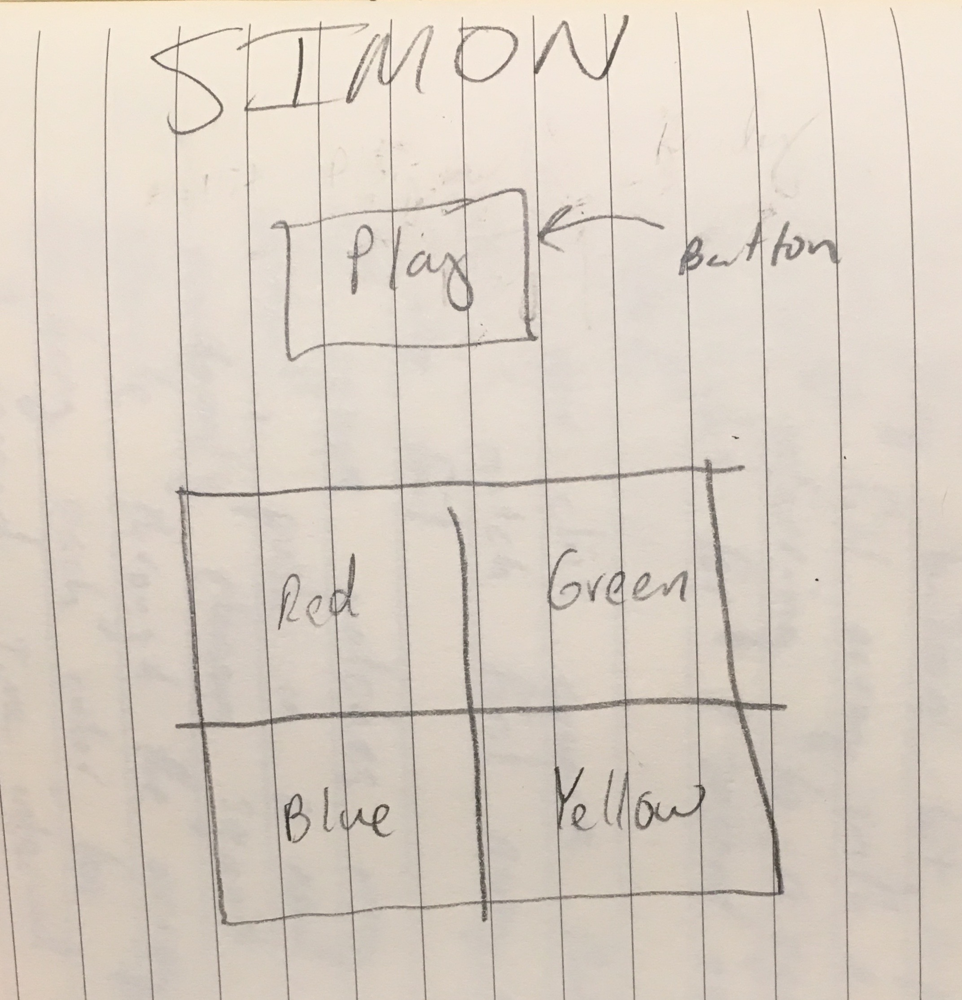

# Simon

## PseudoCode
1. Page loads with four colored squares
1. Empty array for Simon picks is initialized
1. When play button is hit, a random number is pushed into array representing a choice
1. The selection is shown by highlighting square on board for 1 second
1. If user clicks the wrong square, the game is over, title is updated to FAIL
1. If square mathces the first array element, push in a new random number to array 
1. Iterate through the array, flashing each selection on the board for 1 second interval
1. Check then that each square clicked matches the array element in order
1. When wrong square clicked, game is over, fail message

## WireFrame

