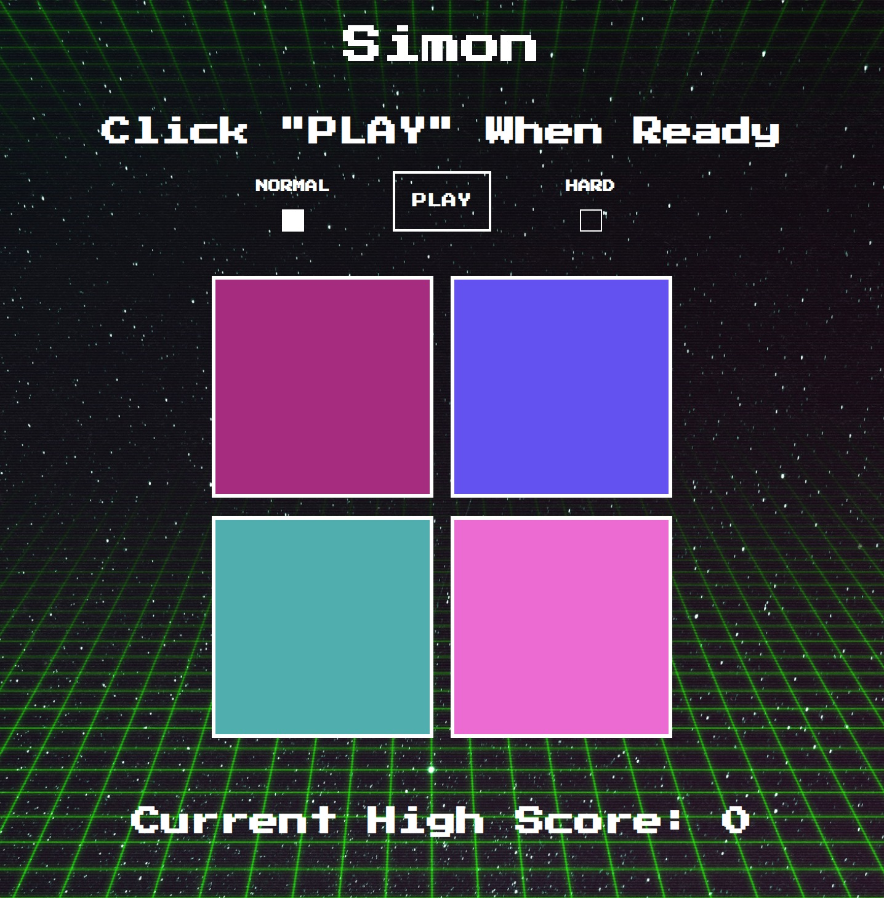

# Simon

### Simon is a classic memory game that requires a user to repeat a growing sequnece of colors and tones.

## 

## Technologies Used
- HTML
- CSS
- JavaScript

## Getting Started
### How To Play
- Simon will select the first square and play a sound
- Repeat the signal by clicking the square
- Simon will add more squares to the pattern every turn
- Try to keep up!

[Go To Game](https://hink123.github.io/simon/)

## Next Steps
#### In the future I plan to add a difficulty setting that will occasionaly shuffle the positions of the squares.

